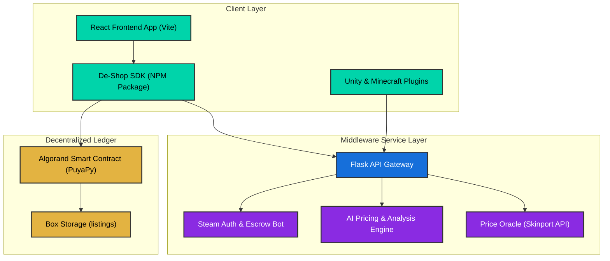

# 🌌 De-Shop SDK
### AI + Blockchain-Powered In-Game Marketplace Infrastructure on Algorand

[](https://developer.algorand.org/)
[](https://www.npmjs.com/package/de-shop-sdk)
[](LICENSE)
[]()
[]()
[]()
[]()
[]()

**De-Shop SDK** is a production-grade, next-generation toolkit designed to help game developers integrate **secure, AI-powered peer-to-peer NFT marketplaces directly into their games**. By marrying the speed and security of the **Algorand blockchain** with custom **AI pricing and visual analysis engines**, De-Shop enables players to truly own their in-game assets as NFTs while providing developers with intelligent tools to sustain and optimize their virtual economies.

📦 **Official Package Published on NPM:**  
👉 **[https://www.npmjs.com/package/de-shop-sdk](https://www.npmjs.com/package/de-shop-sdk)**

---

## 🎯 Executive Summary & Vision

Traditional gaming economies suffer from severe limitations: centralized control with no true digital ownership, rampant trading frauds (wash trading, item duplication, payment chargebacks), and fragmented trading environments where players must use sketchy third-party platforms.

**De-Shop SDK solves this by providing:**
1. **On-Chain Digital Ownership:** Fast, final, and secure in-game assets represented as Algorand Standard Assets (ASAs).
2. **On-Chain Escrow Smart Contracts:** Trustless P2P trades secured by Algorand smart contracts compiled via standard PuyaPy (Algorand Python).
3. **AI Economy Engine:** A dedicated AI-driven "Skin Intelligence Engine" classifying visual attributes, mapping them to game genres, predicting scarcity, and checking prices.
4. **Live Price Oracle:** Built-in price oracle integration mapping live Steam items (e.g. CS2) to on-chain prices via Skinport public APIs.
5. **Cross-Game Bridges:** Seamless integration allowing in-game items to travel across Minecraft and Unity/Unreal Engine runtimes.

---

## 🚀 Phase 2: Premium Enhancement Highlights

### 📊 Dashboard & Analytics
- Real-time marketplace stats (Volume, Listings, Floor Price, 24h Trades)
- Interactive price trend charts with Recharts (7-day history)
- Rarity distribution visualization
- Live market activity feed with Framer Motion animations
- Quick action panels for one-click navigation

### 🏪 Marketplace V2
- Advanced search with full-text filtering
- Rarity, price range, and sort filters
- Grid/List view toggle
- Item detail modal with price history sparkline
- AI Price Analysis with confidence scoring
- Wishlist/favorites system
- 18+ mock listings with realistic data

### 👤 Profile & Achievements
- User profile with wallet & Steam integration
- 8 achievement badges (3 earned, 5 locked)
- Transaction history with status indicators
- Portfolio analytics with pie chart and performance graph
- Connected accounts management

### ✨ Premium Animations
- Canvas-based particle background system
- Confetti burst effects on successful transactions
- Animated gradient border component
- Shimmer, pulse-glow, and floating animations
- Full `prefers-reduced-motion` accessibility support

### 🎨 Theme System
- Dark mode (default cyberpunk) and Light mode
- Persistent theme preference via localStorage
- System preference detection
- Smooth icon transitions with Framer Motion

### 📱 Responsive Design
- Mobile-first approach with 3 breakpoints
- Bottom navigation bar on mobile
- Adaptive card layouts for all screen sizes
- Touch-friendly 44px+ targets

---

## 🏗 System Architecture

The De-Shop ecosystem is designed as a modular, service-oriented architecture with decoupled boundaries:



### Decoupled Service Boundaries

*   **De-Shop SDK (NPM Package):** Client-side library responsible for wallet connection management (using `@txnlab/use-wallet`), on-chain transactions creation, batch minting, and interaction with the Middleware API.
*   **Flask API Gateway / Backend:** Orchestrates data storage, runs the Machine Learning pricing models, caches real-time Skinport prices, verifies Steam OpenID logins, and provides bridges for Unity/Minecraft clients.
*   **Algorand Smart Contracts:** Non-custodial ledger storing current marketplace active listings and enforcing trustless atomicity during P2P swaps.
*   **Steam bot Escrow Engine:** A simulated service that takes physical CS2 assets into Steam inventory escrow and mints corresponding digital receipt NFTs on Algorand.

---

## 📁 Monorepo Workspace Structure

```
De-Shop-SDK/
├── de-shop-sdk/
│   ├── .algokit.toml                  # AlgoKit workspace configuration
│   ├── README.md                      # Inner AlgoKit readme
│   └── projects/
│       ├── de-shop-sdk-contracts/     # Algorand PuyaPy Smart Contracts
│       │   ├── smart_contracts/
│       │   │   └── deshopsdk/
│       │   │       ├── contract.py    # Main PuyaPy contract source
│       │   │       └── deploy_config.py
│       │   └── README.md
│       │
│       ├── de-shop-sdk-frontend/      # React/Vite Demo & Main Web Portal
│       │   ├── src/
│       │   │   ├── components/        # Game Arena, Skin Cards, Web Portal UI
│       │   │   └── sdk/               # De-Shop SDK Package Source Code
│       │   │       ├── DeShopSDK.ts   # Core Client Class (extends EventEmitter)
│       │   │       ├── types.ts       # Type definitions
│       │   │       ├── errors.ts      # Typed error hierarchy
│       │   │       └── README.md      # SDK usage and API reference
│       │   └── README.md
│       │
│       ├── de-shop-sdk-backend/       # Flask API Gateway & AI Engine
│       │   ├── app.py                 # Core endpoints and routes
│       │   └── deshop_backend/
│       │       ├── ai_pricing.py      # AI Pricing & Confidence Engine
│       │       ├── price_oracle.py    # Skinport API Integration
│       │       └── steam_auth.py      # Steam OpenID & Inventory synchronizer
│       │
│       ├── minecraft-plugin/          # Java Spigot bridge for in-game minting
│       └── unity-plugin/              # C# plugin for Unity Engine inventories
│
├── ARCHITECTURE.md                    # In-depth enterprise production plan
└── README.md                          # Master project portal (This file)
```

---

## 🔌 API Reference

### Core Marketplace Endpoints

| Method | Endpoint | Description |
|--------|----------|-------------|
| `GET` | `/health` | Health check & service status |
| `POST` | `/mint` | Mint a new NFT asset |
| `GET` | `/assets/<wallet>` | Get wallet's owned assets |
| `POST` | `/list` | List an asset for sale |
| `POST` | `/buy` | Purchase a listed asset |
| `POST` | `/cancel` | Cancel an active listing |
| `GET` | `/marketplace` | Browse all active listings |

### Search API (Phase 2)

```
GET /api/search?q=&rarity=&min_price=&max_price=&sort=&page=&per_page=
```

| Parameter | Type | Description |
|-----------|------|-------------|
| `q` | string | Full-text search query |
| `rarity` | string | Filter by rarity (common, rare, epic, legendary) |
| `min_price` | number | Minimum price filter (ALGO) |
| `max_price` | number | Maximum price filter (ALGO) |
| `sort` | string | Sort order: `price_asc`, `price_desc`, `newest`, `rarity` |
| `page` | number | Page number for pagination |
| `per_page` | number | Items per page (default: 20) |

### Analytics API (Phase 2)

| Method | Endpoint | Description |
|--------|----------|-------------|
| `GET` | `/api/analytics/market-stats` | Overall marketplace statistics (volume, floor, trades) |
| `GET` | `/api/analytics/price-history/<id>` | Price history data for a specific asset |
| `GET` | `/api/analytics/portfolio/<wallet>` | Portfolio analytics for a wallet |
| `GET` | `/api/analytics/rarity-distribution` | Item distribution across rarity tiers |

### User API (Phase 2)

| Method | Endpoint | Description |
|--------|----------|-------------|
| `GET` | `/api/user/<wallet>/achievements` | User achievement badges and progress |
| `GET` | `/api/user/<wallet>/transactions` | User transaction history with pagination |

### Wishlist API (Phase 2)

| Method | Endpoint | Description |
|--------|----------|-------------|
| `GET` | `/api/wishlist` | Get user's wishlist items |
| `POST` | `/api/wishlist/<asset_id>` | Add item to wishlist |
| `DELETE` | `/api/wishlist/<asset_id>` | Remove item from wishlist |

### AI & Price Oracle Endpoints

| Method | Endpoint | Description |
|--------|----------|-------------|
| `POST` | `/ai-price` | Get AI-powered price suggestion |
| `POST` | `/analyze` | AI visual analysis of a skin |
| `POST` | `/ai/train` | Trigger AI model retraining |
| `GET` | `/oracle/status` | Price oracle health & last sync |
| `GET` | `/prices` | Get current Skinport prices |
| `POST` | `/prices/bulk` | Bulk price lookup |
| `GET` | `/history/<asset_id>` | Asset price history |

### Authentication & Integration

| Method | Endpoint | Description |
|--------|----------|-------------|
| `POST` | `/auth/nonce` | Request auth nonce for wallet signing |
| `POST` | `/auth/verify` | Verify signed message & issue JWT |
| `GET` | `/auth/me` | Get current authenticated user |
| `GET` | `/steam/inventory/<steam_id>` | Fetch Steam inventory |
| `POST` | `/steam/escrow` | Initiate Steam escrow deposit |
| `POST` | `/steam/withdraw` | Withdraw from Steam escrow |
| `GET` | `/bridge/minecraft/<wallet>` | Minecraft inventory bridge |
| `GET` | `/bridge/steam/<wallet>` | Steam inventory bridge |
| `POST` | `/ipfs/upload` | Upload metadata to IPFS |
| `GET` | `/ws/status` | WebSocket connection status |

---

## 📜 Smart Contract Documentation

The De-Shop marketplace is powered by the `Deshopsdk` smart contract, written in **Algorand Python (PuyaPy)** and compiled into secure **TEAL v10 bytecode** conforming to the **ARC-4** standard.

### Storage Architecture
The contract uses **Box Storage** to track listing records dynamically:
*   **Listing Key:** `b"list_" + asset_id` (representing the ASA ID as `UInt64`).
*   **Listing Record Struct (`ListingRecord`):**
    *   `seller` (`arc4.Address`): The account that put the item up for sale.
    *   `price` (`arc4.UInt64`): Listing price in microAlgos.
    *   `creator` (`arc4.Address`): Account designated to receive secondary market royalties.
    *   `royalty_bps` (`arc4.UInt64`): Royalty percentage in basis points (e.g. 500 = 5.0%).

### ABI Methods Reference

#### 1. `setupAsset(asset: Asset, mbr_pay: gtxn.PaymentTransaction) -> None`
Opts the contract into the target Algorand Standard Asset (ASA) so it can act as a trustless escrow agent.
> [!IMPORTANT]
> Requires a preceding payment transaction `mbr_pay` of exactly **100,000 microAlgos (0.1 ALGO)** to the smart contract address to cover the Minimum Balance Requirement (MBR) for holding a new asset.

#### 2. `listAsset(axfer: gtxn.AssetTransferTransaction, price: arc4.UInt64, creator: arc4.Address, royalty_bps: arc4.UInt64) -> None`
Places an asset up for sale in the trustless marketplace escrow.
*   **Parameters:**
    *   `axfer`: Asset transfer transaction depositing exactly `1` unit of the NFT to the contract address.
    *   `price`: The target purchase price in microAlgos (must be > 0).
    *   `creator`: The wallet designated for secondary royalties.
    *   `royalty_bps`: Basis points for royalties (must be between 0 and 1000).

#### 3. `buyAsset(asset: Asset, payment: gtxn.PaymentTransaction) -> None`
Completes the trustless swap. Receives payment from the buyer, splits royalties, transfers the item to the buyer, and clears box storage.
*   **Parameters:**
    *   `asset`: The ASA ID being purchased.
    *   `payment`: Payment transaction from the buyer to the contract address.
*   **Swapping Logic:**
    $$\text{Royalty} = \frac{\text{Price} \times \text{Royalty Bps}}{10,000}$$
    $$\text{Seller Share} = \text{Price} - \text{Royalty}$$
    *   The contract submits internal payment transactions to transfer `Seller Share` to the seller and `Royalty` to the creator.
    *   Submits an internal asset transfer to send the NFT to the buyer and closes the asset balance back to the seller to reclaim the 0.1 ALGO MBR.

#### 4. `cancelListing(asset: Asset) -> None`
Allows the original seller to abort the listing, returning the NFT to their inventory and deleting the Box record.
*   **Parameters:**
    *   `asset`: The ASA ID of the listed skin.

---

## 🧰 Technology Stack

| Layer | Technology | Purpose |
|-------|------------|---------|
| **Blockchain** | Algorand (PuyaPy / AVM) | Smart contracts, ASA NFTs, escrow |
| **Backend** | Flask + SQLAlchemy | API gateway, auth, business logic |
| **Frontend** | React 18 + Vite | Web portal & gaming arena |
| **State Management** | Zustand | Centralized client state store |
| **Data Visualization** | Recharts | Charts, analytics, price trends |
| **Animations** | Framer Motion | Page transitions, micro-interactions |
| **Theme** | CSS Variables + `data-theme` | Dark/Light mode with persistence |
| **Auth** | JWT + Algorand Wallet Sign | Wallet-based authentication |
| **AI Engine** | Custom ML Pipeline | Skin pricing, visual analysis |
| **Price Oracle** | Skinport API | Real-time CS2 price feeds |
| **NFT Storage** | IPFS + Pinata | Decentralized metadata pinning |
| **Game Bridges** | Java (Spigot) / C# (Unity) / C++ (Unreal) | Cross-platform in-game integration |
| **Real-Time** | Flask-SocketIO | WebSocket events & notifications |

---

## ⚡ Master Setup & Installation Guide

To get the entire De-Shop SDK environment running locally for development, follow these steps sequentially:

### 📋 Prerequisites
*   [Node.js (v18.12+) & npm](https://nodejs.org/en/)
*   [Python (3.12+)](https://www.python.org/downloads/)
*   [Docker](https://www.docker.com/) (required to run Algorand LocalNet)
*   [AlgoKit CLI](https://github.com/algorandfoundation/algokit-cli#install) (v2.0.0+)

---

### Step 1: Bootstrap the Workspace & Start LocalNet
Navigate to the AlgoKit workspace folder and bootstrap all projects:

```bash
# Go to the inner workspace
cd de-shop-sdk

# Bootstrap all dependencies, Python virtual envs, and TS modules
algokit project bootstrap all

# Start the Algorand LocalNet Docker containers
algokit localnet start
```

### Step 2: Compile and Deploy Smart Contracts
Deploy the PuyaPy contracts onto the local sandbox:

```bash
# Compile Python contracts into TEAL bytecode
algokit project run build

# Deploy compiled contracts to the LocalNet sandbox
algokit project deploy localnet
```
> [!TIP]
> The deployment script will output the compiled smart contract Application ID. Save this for front-end `.env` configurations.

### Step 3: Run the Middleware Python Backend
Launch the Flask API server, which acts as the economic intelligence layer:

```bash
# Navigate to the backend directory
cd projects/de-shop-sdk-backend

# Activate the python virtual environment created during bootstrap
source .venv/bin/activate

# Launch the Flask application
python app.py
```
*   The backend will start on **`http://localhost:5000`**.
*   **Key Environment Variables (Optional):**
    *   `CREATOR_MNEMONIC`: Mnemonic of the wallet signing transactions on TestNet/MainNet. If omitted, the backend falls back to Mock Minting mode automatically.
    *   `ALGOD_ADDRESS`: Custom Algod API endpoint (defaults to Algonode TestNet).

### Step 4: Run the Vite React Frontend
Launch the developer portal and gaming showcase arena:

```bash
# Navigate to the frontend directory
cd ../de-shop-sdk-frontend

# Run the Vite server
npm run dev
```
*   The application portal will start on **`http://localhost:5173`**.
*   Configure the `.env` file pointing to your contract App ID and local Flask URL.

---

## 📦 Using the NPM SDK

Install the SDK directly from npm:

```bash
npm install de-shop-sdk
```

### Quick Initialization & Method Call
The following snippet shows how to instantiate the client, connect a wallet (such as Pera or Defly via `@txnlab/use-wallet`), analyze a skin using the Machine Learning engine, and mint a digital representation on-chain:

```typescript
import { DeShopSDK, skinIntelligence } from 'de-shop-sdk';

// 1. Initialize the SDK
const sdk = new DeShopSDK({
  network: 'testnet',
  backendUrl: 'http://localhost:5000',
  debug: true
});

// 2. Perform AI Skin Visual Analysis
const analysis = skinIntelligence.analyze({
  name: 'Golden Dragon AWP',
  image: 'ipfs://Qm...',
  attributes: {
    weapon: 'AWP',
    rarity: 'legendary',
    effect: 'reactive gold flame',
    style: 'galaxy'
  }
});

console.log(analysis.suggested_price); // e.g. 450 ALGO
console.log(analysis.rarity_score);    // e.g. 9.8 / 10

// 3. Connect User Wallet Signer (from React use-wallet provider)
sdk.connectWallet(activeAddress, walletSigner);

// 4. Mint the NFT skin on-chain
const skin = await sdk.mintNFT({
  wallet: activeAddress,
  skin_name: 'Golden Dragon AWP',
  rarity: 'legendary',
  royalty_bps: 500 // 5.0% secondary market royalty
});

console.log(`On-chain NFT Minted! ASA ID: ${skin.asa_id}`);
```

---

## 🤝 Clean Commits & Contribution Guidelines

We enforce the **Conventional Commits** standard to ensure a clean, understandable, and automatable project release history. 

### Commit Format
```
<type>(<scope>): <short description>

[optional body description explaining the rationale]

[optional footer referencing issue tracker IDs]
```

### Commit Types Reference
*   `feat`: A new user-facing feature (e.g. `feat(sdk): add batch minting support up to 16 items`).
*   `fix`: A bug fix (e.g. `fix(frontend): auto-close wallet connection modal after success`).
*   `docs`: Documentation improvements (e.g. `docs(readme): add detailed PuyaPy smart contract ABI docs`).
*   `refactor`: Code changes that neither fix a bug nor add a feature, but improve quality (e.g. `refactor(contracts): reuse asset opt-in internal txns`).
*   `test`: Adding or correcting tests (e.g. `test(sdk): write integration tests for Escrow buy flow`).
*   `chore`: Updating dev tools, dependencies, or internal tasks (e.g. `chore(deps): bump flask-cors version`).

---

**De-Shop SDK — Powering the future of AI-driven, decentralized gaming economies.**
For feedback or questions, visit our [official repository](https://github.com/captainRam1413/De-Shop-SDK) or the [NPM package page](https://www.npmjs.com/package/de-shop-sdk).
